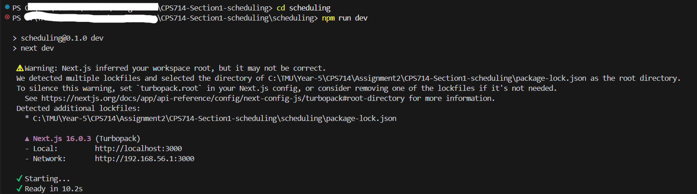
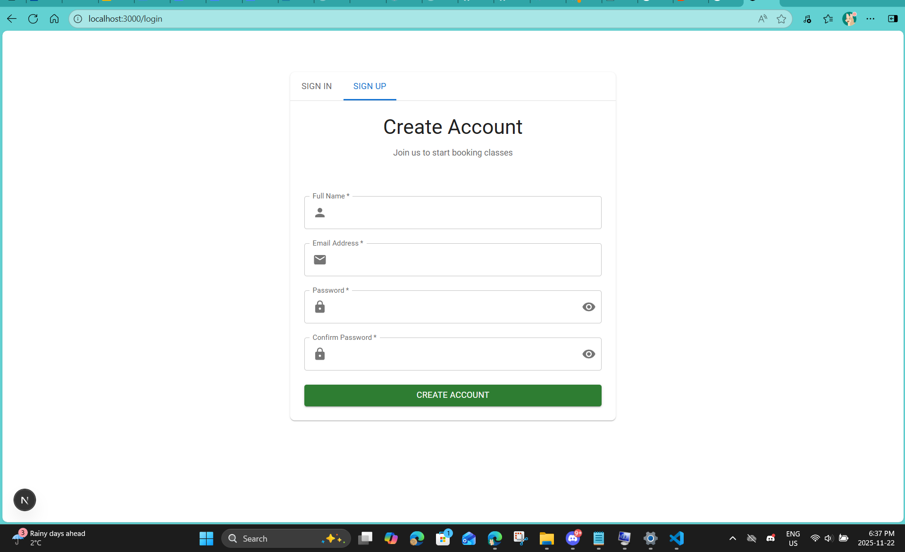
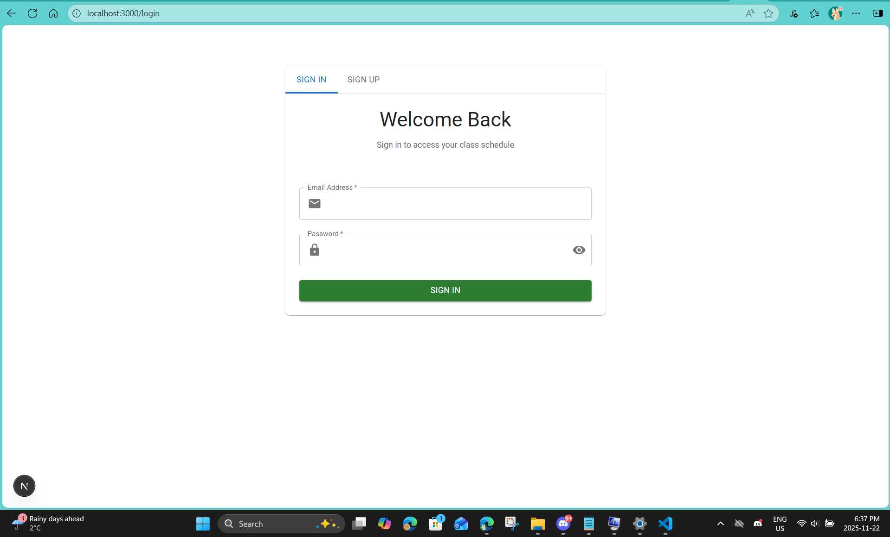
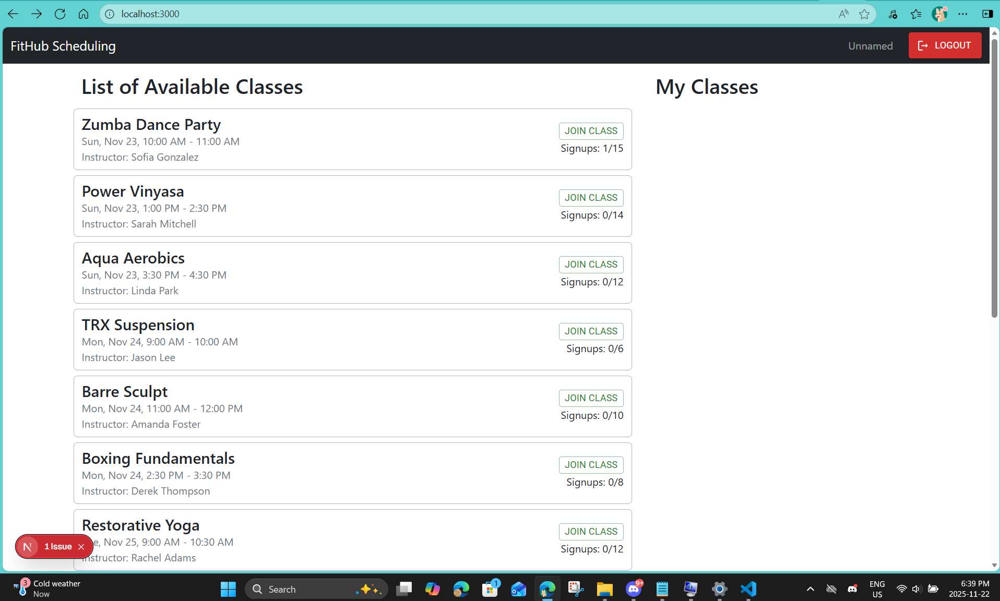
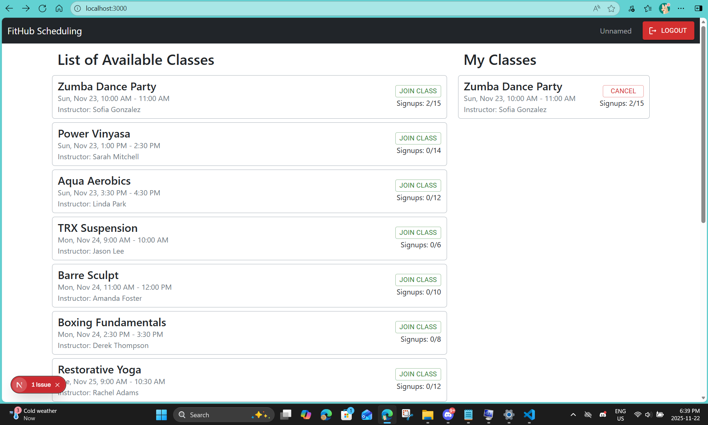
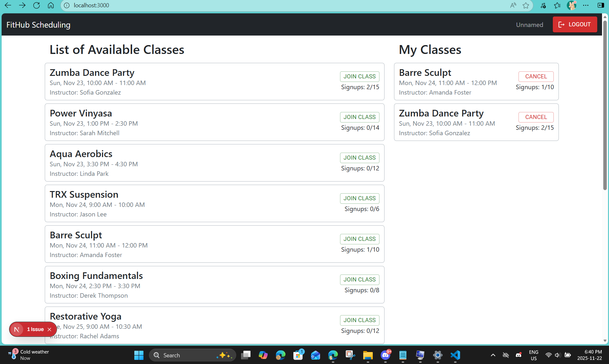

# CPS714-Section1

# FitHub Sub-Project 3 - Scheduling

## What it does ❓
- Allows Users to Schedule Classes on the FitHub Application

## How we built it 🔨
- Our front-end and user-interface was designed and built using React
- API endpoints and all request handling was done with NodeJS/Firebase

## Try it out 🏗
Set up repository 
```
git clone https://github.com/RishieNagarajah/CPS714-Section1-scheduling.git/
```

This sytem was tested on node v24.11.1
Once you have cloned the repository, open up the terminal in the folder where the project is located and run the following commands: 
```
cd scheduling
npm install
npm run dev
```
Your Terminal may look like the following:


Now go to the locally hosted site: http://localhost:3000

Then (if you have not already done so) create an account. Or Sign In.

If you do not have an account please register for an account under the SIGN UP tab.


If you do have an account please register for an account under the SIGN IN tab.


You can know see the list of available classes available for your profile, Click the "Join" Button on any of the classes to join.


Once you joined a class, you can see it unde the right hand side of the screen in the "My Classes" Section, Click the "Join" Button on multiple classes. Additionally Click "Cancel" on any of the classes to remove the class from the "My Classes" Section.




